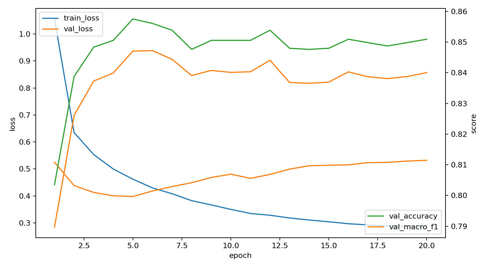
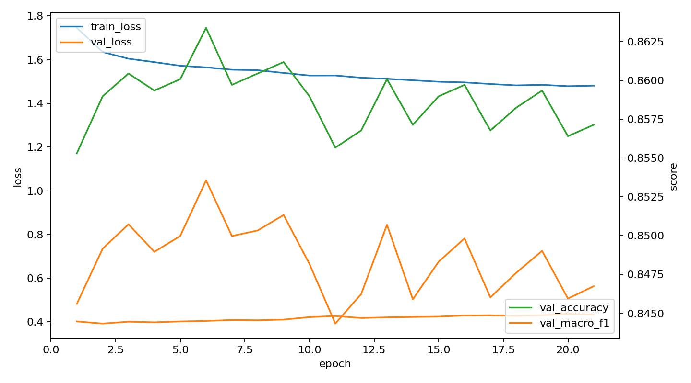
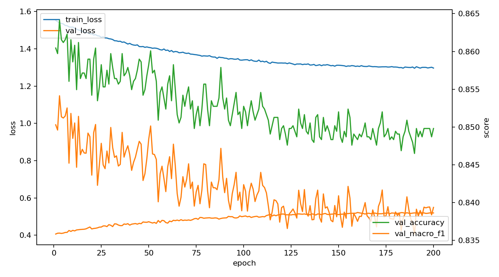
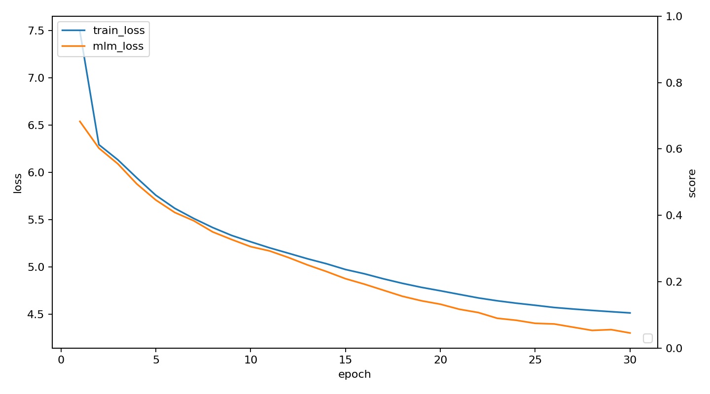
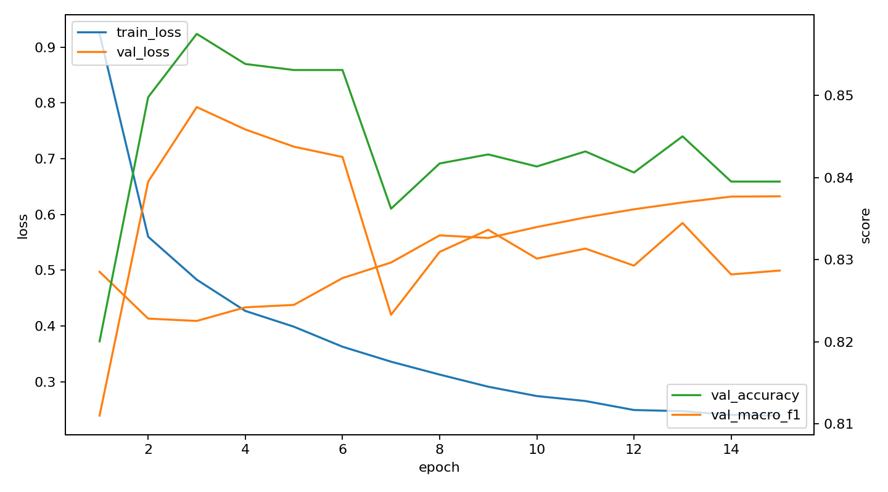

# Tiny MathNet Grokking Encoder Report

## Run Summary
- Run directory: `runs/tiny_mathnet_grokking`
- Logged phases: finetune, joint, long_joint, pretrain, supervised
- Evaluation files: 4

## Benchmark
```json
{
  "benchmark_mlx.json": {
    "backend": "mlx",
    "batch_size": 512,
    "elapsed_s": 7.505304916994646,
    "last_loss": 1.3700062036514282,
    "ok": true,
    "samples_per_s": 682.1841426331023,
    "step_s": 0.7505304916994646,
    "steps": 10,
    "tokens_per_s": 174639.14051407418
  },
  "benchmark_summary.json": {
    "dataloader": {
      "backend": "torch_dataloader",
      "batch_size": 512,
      "results": [
        {
          "elapsed_s": 0.02279166699736379,
          "num_workers": 0,
          "ok": true,
          "samples_per_s": 179714.8054362924
        },
        {
          "num_workers": 2,
          "ok": false,
          "reason": "macOS multiprocessing spawn is not used for the main path; device-resident batches are faster and avoid worker stalls",
          "skipped": true
        },
        {
          "num_workers": 4,
          "ok": false,
          "reason": "macOS multiprocessing spawn is not used for the main path; device-resident batches are faster and avoid worker stalls",
          "skipped": true
        },
        {
          "num_workers": 8,
          "ok": false,
          "reason": "macOS multiprocessing spawn is not used for the main path; device-resident batches are faster and avoid worker stalls",
          "skipped": true
        }
      ]
    },
    "mlx": {
      "backend": "mlx",
      "batch_size": 512,
      "elapsed_s": 7.505304916994646,
      "last_loss": 1.3700062036514282,
      "ok": true,
      "samples_per_s": 682.1841426331023,
      "step_s": 0.7505304916994646,
      "steps": 10,
      "tokens_per_s": 174639.14051407418
    },
    "tiny_overfit": {
      "accuracy": 1.0,
      "batch_size": 64,
      "loss": 3.232743983971886e-05,
      "macro_f1": 1.0,
      "steps": 120
    },
    "torch": {
      "amp": false,
      "backend": "torch",
      "best": {
        "batch_size": 512,
        "elapsed_s": 10.20758395899611,
        "last_loss": 7.543945789337158,
        "ok": true,
        "samples_per_s": 401.2702728141783,
        "step_s": 1.2759479948745138,
        "steps": 8,
        "tokens_per_s": 102725.18984042965
      },
      "device": "mps",
      "memory": {
        "rss": 1153826816
      },
      "params": 656324,
      "results": [
        {
          "batch_size": 64,
          "elapsed_s": 2.097473665999132,
          "last_loss": 7.599643230438232,
          "ok": true,
          "samples_per_s": 244.10318389199352,
          "step_s": 0.2621842082498915,
          "steps": 8,
          "tokens_per_s": 62490.41507635034
        },
        {
          "batch_size": 128,
          "elapsed_s": 3.1919094160111854,
          "last_loss": 7.603436470031738,
          "ok": true,
          "samples_per_s": 320.81110913218083,
          "step_s": 0.3989886770013982,
          "steps": 8,
          "tokens_per_s": 82127.6439378383
        },
        {
          "batch_size": 256,
          "elapsed_s": 5.461709042006987,
          "last_loss": 7.580256938934326,
          "ok": true,
          "samples_per_s": 374.9742039073234,
          "step_s": 0.6827136302508734,
          "steps": 8,
          "tokens_per_s": 95993.39620027479
        },
        {
          "batch_size": 384,
          "elapsed_s": 7.8002254589955555,
          "last_loss": 7.536417007446289,
          "ok": true,
          "samples_per_s": 393.8347700523499,
          "step_s": 0.9750281823744444,
          "steps": 8,
          "tokens_per_s": 100821.70113340157
        },
        {
          "batch_size": 512,
          "elapsed_s": 10.20758395899611,
          "last_loss": 7.543945789337158,
          "ok": true,
          "samples_per_s": 401.2702728141783,
          "step_s": 1.2759479948745138,
          "steps": 8,
          "tokens_per_s": 102725.18984042965
        }
      ]
    }
  },
  "benchmark_torch.json": {
    "amp": false,
    "backend": "torch",
    "best": {
      "batch_size": 512,
      "elapsed_s": 10.20758395899611,
      "last_loss": 7.543945789337158,
      "ok": true,
      "samples_per_s": 401.2702728141783,
      "step_s": 1.2759479948745138,
      "steps": 8,
      "tokens_per_s": 102725.18984042965
    },
    "device": "mps",
    "memory": {
      "rss": 1153826816
    },
    "params": 656324,
    "results": [
      {
        "batch_size": 64,
        "elapsed_s": 2.097473665999132,
        "last_loss": 7.599643230438232,
        "ok": true,
        "samples_per_s": 244.10318389199352,
        "step_s": 0.2621842082498915,
        "steps": 8,
        "tokens_per_s": 62490.41507635034
      },
      {
        "batch_size": 128,
        "elapsed_s": 3.1919094160111854,
        "last_loss": 7.603436470031738,
        "ok": true,
        "samples_per_s": 320.81110913218083,
        "step_s": 0.3989886770013982,
        "steps": 8,
        "tokens_per_s": 82127.6439378383
      },
      {
        "batch_size": 256,
        "elapsed_s": 5.461709042006987,
        "last_loss": 7.580256938934326,
        "ok": true,
        "samples_per_s": 374.9742039073234,
        "step_s": 0.6827136302508734,
        "steps": 8,
        "tokens_per_s": 95993.39620027479
      },
      {
        "batch_size": 384,
        "elapsed_s": 7.8002254589955555,
        "last_loss": 7.536417007446289,
        "ok": true,
        "samples_per_s": 393.8347700523499,
        "step_s": 0.9750281823744444,
        "steps": 8,
        "tokens_per_s": 100821.70113340157
      },
      {
        "batch_size": 512,
        "elapsed_s": 10.20758395899611,
        "last_loss": 7.543945789337158,
        "ok": true,
        "samples_per_s": 401.2702728141783,
        "step_s": 1.2759479948745138,
        "steps": 8,
        "tokens_per_s": 102725.18984042965
      }
    ]
  }
}
```

## Evaluation
```json
{
  "finetune_best_test": {
    "checkpoint": "runs/tiny_mathnet_grokking/checkpoints/finetune_best.pt",
    "confusion_matrix": [
      [
        644,
        61,
        15,
        66
      ],
      [
        45,
        474,
        29,
        39
      ],
      [
        16,
        27,
        788,
        1
      ],
      [
        40,
        55,
        5,
        419
      ]
    ],
    "metrics": {
      "accuracy": 0.8535242290748899,
      "loss": 0.42253797749678296,
      "macro_f1": 0.8439039068545436
    },
    "report": {
      "Algebra": {
        "f1-score": 0.8412802090137165,
        "precision": 0.8644295302013423,
        "recall": 0.8193384223918575,
        "support": 786.0
      },
      "Combinatorics": {
        "f1-score": 0.7873754152823921,
        "precision": 0.7682333873581848,
        "recall": 0.807495741056218,
        "support": 587.0
      },
      "Geometry": {
        "f1-score": 0.9442780107849011,
        "precision": 0.9414575866188769,
        "recall": 0.9471153846153846,
        "support": 832.0
      },
      "Number Theory": {
        "f1-score": 0.8026819923371648,
        "precision": 0.7980952380952381,
        "recall": 0.8073217726396917,
        "support": 519.0
      },
      "accuracy": 0.8535242290748899,
      "macro avg": {
        "f1-score": 0.8439039068545436,
        "precision": 0.8430539355684106,
        "recall": 0.845317830175788,
        "support": 2724.0
      },
      "weighted avg": {
        "f1-score": 0.8537690426033668,
        "precision": 0.8545883809676372,
        "recall": 0.8535242290748899,
        "support": 2724.0
      }
    },
    "split": "test"
  },
  "joint_best_test": {
    "checkpoint": "runs/tiny_mathnet_grokking/checkpoints/joint_best.pt",
    "confusion_matrix": [
      [
        652,
        64,
        13,
        57
      ],
      [
        43,
        492,
        18,
        34
      ],
      [
        11,
        27,
        793,
        1
      ],
      [
        46,
        64,
        5,
        404
      ]
    ],
    "metrics": {
      "accuracy": 0.8593979441997063,
      "loss": 0.424973006049792,
      "macro_f1": 0.8490416886909877
    },
    "report": {
      "Algebra": {
        "f1-score": 0.8478543563068921,
        "precision": 0.8670212765957447,
        "recall": 0.8295165394402035,
        "support": 786.0
      },
      "Combinatorics": {
        "f1-score": 0.7974068071312804,
        "precision": 0.7604327666151468,
        "recall": 0.838160136286201,
        "support": 587.0
      },
      "Geometry": {
        "f1-score": 0.954846478025286,
        "precision": 0.9565741857659831,
        "recall": 0.953125,
        "support": 832.0
      },
      "Number Theory": {
        "f1-score": 0.7960591133004926,
        "precision": 0.8145161290322581,
        "recall": 0.7784200385356455,
        "support": 519.0
      },
      "accuracy": 0.8593979441997063,
      "macro avg": {
        "f1-score": 0.8490416886909877,
        "precision": 0.8496360895022832,
        "recall": 0.8498054285655126,
        "support": 2724.0
      },
      "weighted avg": {
        "f1-score": 0.8597937846414362,
        "precision": 0.8614010098870728,
        "recall": 0.8593979441997063,
        "support": 2724.0
      }
    },
    "split": "test"
  },
  "long_joint_best_test": {
    "checkpoint": "runs/tiny_mathnet_grokking/checkpoints/long_joint_best.pt",
    "confusion_matrix": [
      [
        657,
        64,
        11,
        54
      ],
      [
        48,
        489,
        16,
        34
      ],
      [
        12,
        26,
        793,
        1
      ],
      [
        52,
        61,
        5,
        401
      ]
    ],
    "metrics": {
      "accuracy": 0.8590308370044053,
      "loss": 0.4331231862306595,
      "macro_f1": 0.8485199882432678
    },
    "report": {
      "Algebra": {
        "f1-score": 0.845016077170418,
        "precision": 0.8543563068920677,
        "recall": 0.8358778625954199,
        "support": 786.0
      },
      "Combinatorics": {
        "f1-score": 0.7970660146699267,
        "precision": 0.7640625,
        "recall": 0.8330494037478705,
        "support": 587.0
      },
      "Geometry": {
        "f1-score": 0.9571514785757392,
        "precision": 0.9612121212121212,
        "recall": 0.953125,
        "support": 832.0
      },
      "Number Theory": {
        "f1-score": 0.7948463825569871,
        "precision": 0.8183673469387756,
        "recall": 0.7726396917148363,
        "support": 519.0
      },
      "accuracy": 0.8590308370044053,
      "macro avg": {
        "f1-score": 0.8485199882432678,
        "precision": 0.8494995687607412,
        "recall": 0.8486729895145317,
        "support": 2724.0
      },
      "weighted avg": {
        "f1-score": 0.8593743355320437,
        "precision": 0.860679105222788,
        "recall": 0.8590308370044053,
        "support": 2724.0
      }
    },
    "split": "test"
  },
  "supervised_best_test": {
    "checkpoint": "runs/tiny_mathnet_grokking/checkpoints/supervised_best.pt",
    "confusion_matrix": [
      [
        638,
        71,
        13,
        64
      ],
      [
        27,
        492,
        19,
        49
      ],
      [
        14,
        33,
        781,
        4
      ],
      [
        33,
        60,
        3,
        423
      ]
    ],
    "metrics": {
      "accuracy": 0.8568281938325991,
      "loss": 0.4185381432374318,
      "macro_f1": 0.8475294845810952
    },
    "report": {
      "Algebra": {
        "f1-score": 0.8518024032042724,
        "precision": 0.8960674157303371,
        "recall": 0.811704834605598,
        "support": 786.0
      },
      "Combinatorics": {
        "f1-score": 0.7916331456154465,
        "precision": 0.75,
        "recall": 0.838160136286201,
        "support": 587.0
      },
      "Geometry": {
        "f1-score": 0.9478155339805825,
        "precision": 0.9571078431372549,
        "recall": 0.9387019230769231,
        "support": 832.0
      },
      "Number Theory": {
        "f1-score": 0.7988668555240793,
        "precision": 0.7833333333333333,
        "recall": 0.815028901734104,
        "support": 519.0
      },
      "accuracy": 0.8568281938325991,
      "macro avg": {
        "f1-score": 0.8475294845810952,
        "precision": 0.8466271480502313,
        "recall": 0.8508989489257066,
        "support": 2724.0
      },
      "weighted avg": {
        "f1-score": 0.8580762730116253,
        "precision": 0.8617557688158007,
        "recall": 0.8568281938325991,
        "support": 2724.0
      }
    },
    "split": "test"
  }
}
```

## Curves




